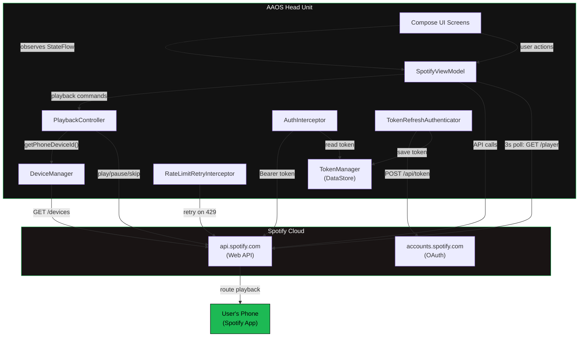
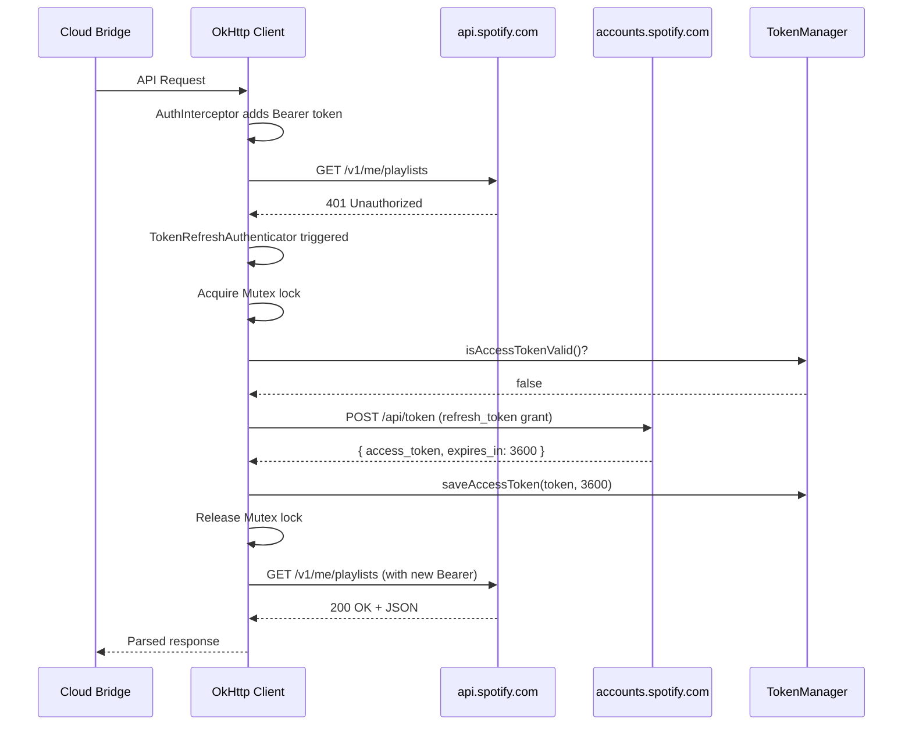
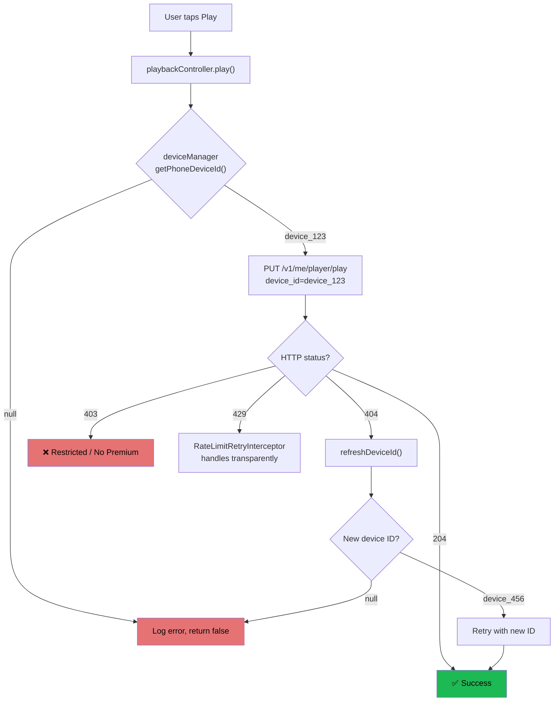
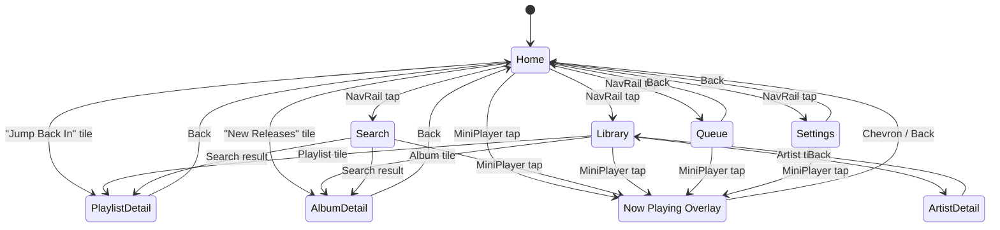

# Software Design Specification — Cloud-Bridge (AAOS)

> **Version**: 2.8.0  
> **Date**: 2026-03-11  
> **Author**: Senior Android Architect  
> **Platform**: Android Automotive OS (AAOS) API 30+ / targetSdk 35  
> **Language**: Kotlin 2.0

---

## Table of Contents

1. [Introduction & Architecture](#1-introduction--architecture)
2. [Authentication & Networking](#2-authentication--networking)
3. [Playback & Device Management](#3-playback--device-management)
4. [User Interface](#4-user-interface)
5. [API Hacks & Known Limitations](#5-api-hacks--known-limitations)
6. [Testing Strategy](#6-testing-strategy)
7. [File & Directory Structure](#7-file--directory-structure)
8. [Extended Features](#8-extended-features-v13)

---

## 1. Introduction & Architecture

### 1.1 What is Cloud-Bridge?

**Cloud-Bridge** is an independent, open-source educational Android Automotive OS template that demonstrates how to build a Spotify Web API-powered in-car interface _without_ bundling the Spotify Android SDK or using the native `MediaBrowserService` template system.

Instead of playing audio locally, the app operates as a **remote control**: it sends REST commands to the Spotify Web API, which in turn routes playback to the user's phone (connected via Bluetooth or Wi-Fi to the car's audio system). The car's head unit acts purely as a display and input surface — a "bridge to the cloud."

This project is not an official Spotify client and should be understood as a bring-your-own-key developer template.

### 1.2 Why Cloud Bridge?

| Challenge | Cloud Bridge Solution |
|---|---|
| AAOS MediaBrowserService templates are visually rigid and offer limited UX | Custom Jetpack Compose UI with full creative control |
| Spotify's Android SDK requires audio focus negotiation on the car | No local audio — playback happens on the phone |
| Car OEMs restrict sideloaded apps with UXR (User Experience Restrictions) | `distractionOptimized` manifest flag bypasses UXR |
| Token management is complex for in-car apps without a browser | QR companion onboarding + automatic background refresh |

### 1.3 Architecture Overview

The application follows a **MVVM + repository/domain** split with:

- **Data layer**: Retrofit interfaces + Room-backed `SpotifyLibraryRepository`
- **Domain layer**: `CustomMixEngine` for generated playback queues
- **ViewModel**: `SpotifyViewModel` — the single source of truth for UI state and navigation
- **View**: Jetpack Compose screens observing `StateFlow`s

```
┌─────────────────────────────────────────────────────────────┐
│                    AAOS Head Unit                            │
│                                                             │
│  ┌───────────┐    ┌──────────────┐    ┌──────────────────┐  │
│  │  Compose   │◄──│ SpotifyView  │◄──│ SpotifyLibraryRepo │  │
│  │  Screens   │   │   Model      │   │ + CustomMixEngine  │  │
│  └───────────┘    └──────┬───────┘    └────────┬─────────┘  │
│                          │                     │             │
│                          ▼                     ▼             │
│                  ┌──────────────┐    ┌──────────────────┐   │
│                  │  Playback    │    │  Token            │   │
│                  │  Controller  │    │  Manager          │   │
│                  └──────┬───────┘    └────────┬─────────┘   │
│                         │                     │             │
└─────────────────────────┼─────────────────────┼─────────────┘
                          │  HTTP/REST          │  HTTP/REST
                          ▼                     ▼
              ┌───────────────────┐  ┌────────────────────┐
              │  api.spotify.com  │  │ accounts.spotify.com│
              │  (Web API)        │  │ (OAuth)             │
              └─────────┬─────────┘  └────────────────────┘
                        │
                        ▼
              ┌───────────────────┐
              │  User's Phone     │
              │  (Spotify App)    │
              │  🔊 Audio Output   │
              └───────────────────┘
```

### 1.4 Data Flow Diagram



### 1.5 Technology Stack

| Component | Technology | Version |
|---|---|---|
| Language | Kotlin | 2.0 |
| UI Framework | Jetpack Compose BOM | 2024.12.01 |
| Design System | Material 3 | (via BOM) |
| HTTP Client | OkHttp | 4.12.0 |
| REST Client | Retrofit | 2.11.0 |
| JSON Parser | Moshi + KSP | 1.15.1 |
| Image Loading | Coil | 2.7.0 |
| Persistence | DataStore Preferences | 1.1.1 |
| Build System | Gradle Kotlin DSL | 8.9 |
| Min SDK | 30 | (Android 11 — AAOS baseline) |
| Target SDK | 35 | (Android 15) |
| Test: Unit | JUnit 4 + MockK | — |
| Test: Integration | MockWebServer | (OkHttp) |
| Test: Android | Robolectric | — |

### 1.6 The `distractionOptimized` Bypass

AAOS enforces **User Experience Restrictions (UXR)** while the vehicle is in motion:

- Lists are truncated to ~6 items
- Text input is disabled
- Touch interactions are limited

To deliver the full Spotify browsing experience, `MainActivity` declares:

```xml
<meta-data
    android:name="distractionOptimized"
    android:value="true" />
```

This tells the OS: _"I have designed this Activity for safe in-motion use."_ The OS trusts the declaration and exempts the Activity from all UXR constraints. This is the same mechanism OEM-bundled media apps use.

> **Note**: The `SetupActivity` (credential entry) does NOT have this flag — it is only usable while the vehicle is parked, which is the correct safety posture for a text-input-heavy settings screen.

---

## 2. Authentication & Networking

### 2.1 OAuth 2.0 Flow

The app uses the **Refresh Token Grant** flow (no Authorization Code PKCE flow on the car itself):

1. **One-time setup**: The user obtains a long-lived refresh token via a browser-based Authorization Code flow on a PC/phone and enters it into `SetupActivity`.
2. **Automatic refresh**: `TokenRefreshAuthenticator` transparently exchanges the refresh token for a short-lived access token (TTL: 3600 s) whenever a 401 is received.
3. **Token storage**: `TokenManager` persists the active profile ID and app preferences in AndroidX DataStore, while Room persists each profile's Spotify credentials with Flow-based reactive observation.



### 2.2 Two-Client Architecture

| Client | Base URL | OkHttp Features | Purpose |
|---|---|---|---|
| `apiClient` | `api.spotify.com` | `AuthInterceptor` + `RateLimitRetryInterceptor` + `TokenRefreshAuthenticator` + debug logging | All data & playback API calls |
| `authClient` | `accounts.spotify.com` | Debug logging only | Token refresh (form-encoded POST) |

The auth client **must not** include `AuthInterceptor` or `TokenRefreshAuthenticator` — doing so would create a circular dependency (the interceptor needs a token → token refresh needs the auth client → the auth client would try to add a token...).

### 2.3 Mutex-Guarded Token Refresh

When multiple API calls fail with 401 simultaneously (e.g., during `loadHomeFeed` where 5+ calls fire concurrently via `supervisorScope`), the `TokenRefreshAuthenticator` uses a Kotlin `Mutex` to serialize refresh attempts:

```kotlin
refreshMutex.withLock {
    // Double-check: token may have been refreshed while we waited
    if (tokenManager.isAccessTokenValid()) {
        // Reuse the fresh token — skip the refresh call
        return response.request.newBuilder()
            .header("Authorization", "Bearer $freshToken")
            .build()
    }
    // Only the first thread performs the actual refresh
    val tokenResponse = authService.refreshToken(...)
    tokenManager.saveAccessToken(tokenResponse.accessToken, tokenResponse.expiresIn)
}
```

This prevents **refresh storms** — without the mutex, 5 concurrent 401s would fire 5 refresh calls, wasting rate-limit budget and potentially causing token-invalidation race conditions.

### 2.4 Rate Limit Interceptor (429 Handling)

Spotify's API returns `429 Too Many Requests` with a `Retry-After` header (in seconds). The `RateLimitRetryInterceptor` handles this transparently:

| Retry-After Value | Behaviour |
|---|---|
| ≤ 10 seconds | Sleep on the OkHttp thread, then retry (up to 3 times) |
| > 10 seconds | **Immediately surface** the 429 to the caller |

The 10-second cap was added after a production incident where `retry-after: 4664` (77 minutes) caused `Thread.sleep` to block all OkHttp dispatcher threads for over an hour — effectively freezing the entire app.

### 2.5 Token Storage (DataStore + Room)

| Key | Type | Description |
|---|---|---|
| `active_profile_id` | `String` | Room ID of the currently selected Spotify profile |
| `rate_limit_until_epoch_ms` | `Long` | Global Spotify lockout-until timestamp |
| `rate_limit_retry_after_seconds` | `Long` | Original `Retry-After` value |
| `locked_device_id` | `String` | Optional playback-device lock |
| `locked_device_name` | `String` | Device lock label |

A **60-second safety margin** is applied to `isAccessTokenValid()` to avoid mid-flight expiry on high-latency networks.

The Room `user_profiles` table stores the actual Spotify credentials and profile metadata for each account: display name, client ID, optional client secret, refresh token, access token, access-token expiry, and optional avatar URL.

### 2.6 Multi-Profile QR Onboarding (Phase 1)

Phase 1 introduces a Smart-TV-style pairing flow for adding Spotify accounts from a passenger phone instead of typing secrets on the car display.

1. `AddProfileViewModel` generates a 6-character session code.
2. `AddProfileScreen` renders a QR code for the companion web URL.
3. The phone/browser writes a `CloudSessionPayload` into the cloud relay.
4. The car polls `CloudRelayService.getSession(sessionId)` every 3 seconds.
5. The app inserts a new Room `UserProfile`, marks it active, clears global cache/pin tables, and reloads account data.
6. The relay payload is deleted after a successful one-time transfer.

Because library cache rows and pinned items are not yet profile-scoped in Phase 1, profile switching clears those tables as a temporary isolation boundary.

---

## 3. Playback & Device Management

### 3.1 Device Discovery (`DeviceManager`)

Every playback command to the Spotify Web API requires a `device_id` parameter. Without it, Spotify routes playback to the "last active" device — which might be a smart speaker, another phone, or the car's built-in Spotify.

`DeviceManager` discovers and caches the user's phone:

**Selection Priority:**

| Priority | Criteria | Rationale |
|---|---|---|
| 1 | Active smartphone | Best case — phone is playing and connected |
| 2 | Any smartphone | Phone exists but may be idle |
| 3 | Any active device | Fallback — speaker, tablet, etc. |
| 4 | `null` | No Spotify Connect devices found |

**Cache TTL**: 2 minutes. Devices can appear/disappear as the phone connects to/disconnects from Spotify Connect.

### 3.2 Playback Controller (`SpotifyPlaybackController`)

The controller wraps each Spotify Web API playback endpoint with error handling and device management:



### 3.3 Metadata Polling Loop

The `SpotifyViewModel` runs a **3-second polling loop** that calls `GET /v1/me/player` to sync the car's Now Playing UI with the phone's actual playback state:

```kotlin
private fun startMetadataSync() {
    metadataSyncJob = viewModelScope.launch {
        while (isActive) {
            syncPlaybackState()  // GET /v1/me/player
            delay(3000L)
        }
    }
}
```

**Why polling?** Spotify's Web API has no WebSocket or push notification mechanism for playback state changes. The only way to detect track changes, progress updates, shuffle/repeat toggles, and play/pause transitions is to poll.

To prevent pathological 429 cooldown loops, the app now persists a **global Spotify rate-limit lockout** in DataStore. Once Spotify returns a long `Retry-After`, every subsequent `api.spotify.com` request is short-circuited by `AuthInterceptor` until the stored timestamp expires, and the UI presents a global warning banner instead of letting individual screens fail quietly.

**3 seconds** is the chosen interval because:
- Responsive enough that track changes appear within one poll cycle
- Conservative enough to stay well under Spotify's ~180 req/min rate limit
- Each poll is a single lightweight GET request (~1 KB response)

### 3.4 Playback Command Summary

| Action | API Endpoint | HTTP Method | Notes |
|---|---|---|---|
| Play track in context | `/v1/me/player/play` | `PUT` | `context_uri` + `offset.uri` |
| Play single track | `/v1/me/player/play` | `PUT` | `uris: [trackUri]` |
| Resume | `/v1/me/player/play` | `PUT` | No body |
| Pause | `/v1/me/player/pause` | `PUT` | — |
| Next | `/v1/me/player/next` | `POST` | — |
| Previous | `/v1/me/player/previous` | `POST` | — |
| Seek | `/v1/me/player/seek` | `PUT` | `position_ms` query param |
| Shuffle | `/v1/me/player/shuffle` | `PUT` | `state` query param (boolean) |
| Repeat | `/v1/me/player/repeat` | `PUT` | `state`: "off"/"context"/"track" |
| Add to Queue | `/v1/me/player/queue` | `POST` | `uri` query param |

When the optional **Clean Swapper** mode is enabled, the app prefers URI-list playback for detail, radio, and custom-mix flows so explicit tracks can be replaced with cached clean equivalents before the command reaches Spotify.

---

## 4. User Interface

### 4.1 Design Philosophy

The UI follows a **CarPlay-inspired** dark aesthetic specifically designed for automotive displays:

- **Dark-mode only**: Reduces glare during nighttime driving; uses a green-accent dark palette tuned for the template UI.
- **Large touch targets**: Minimum 56 dp, primary controls 72–96 dp — essential for accurate tapping on large automotive touchscreens.
- **4-column grid**: Optimised for landscape ~17" head-unit displays at 1920×1080 or 2560×1440.
- **Album-art-forward**: Every navigable item is represented by a large square tile with cover art, gradient overlay, and white text.
- **NavigationRail**: Vertical rail on the left (driver) side with Home, Search, Library, Queue, and Settings icons. **Always visible** — never hidden by the Now Playing overlay.
- **Edge-to-edge display**: Transparent system bars with `WindowCompat.setDecorFitsSystemWindows(window, false)` for full-bleed content.
- **Grid/List toggle**: Playlists support both grid and list view modes.

### 4.2 Navigation Architecture

Navigation is handled manually via a sealed `Screen` class and a mutable back-stack in `SpotifyViewModel` — no Jetpack Navigation Compose dependency:



### 4.3 Screen Inventory

#### Home Screen


The default landing page. Displays a 4-column `LazyVerticalGrid` with a time-of-day greeting card, a persistent Clean Swapper toggle, and these sections:

| Section | Data Source | Max Tiles | Order |
|---|---|---|---|
| Jump Back In | `GET /v1/me/player/recently-played` → hydrated playlist/album metadata | 8 | 1st |
| Your Podcasts | `GET /v1/me/shows` → sorted by most-recent episode (via `GET /v1/shows/{id}/episodes?limit=1`) | unlimited | 2nd |
| Suggested For You | Top-artist-seeded playlist search | 12 | 3rd |
| New Releases | Latest albums from user's top 5 artists | 12 | 4th |

Podcasts are intentionally placed second for quick access. They are sorted by the release date of each show's most recent episode (descending), fetched via parallel `getShowEpisodes` calls. The Clean Swapper toggle persists to DataStore and activates repository-backed explicit-to-clean URI translation during supported playback flows.

Empty-state: "No Spotify data available" with a Retry button.

#### Search Screen

Full-text search with a debounced (300 ms) `OutlinedTextField`. Results are displayed in a 4-column grid merging playlists, albums, and tracks into a unified `SearchResultItem` list.

Tapping a result navigates to the appropriate detail screen (playlist/album) or starts immediate playback (track).

#### Library Screen

Tabbed interface with five tabs:

| Tab | Content | View Modes |
|---|---|---|
| Playlists | All user playlists + synthetic "Liked Songs" tile | Grid (4-column) / List (toggle) |
| Albums | Saved albums | 4-column grid |
| Artists | Followed artists (circular images) | 4-column grid |
| Podcasts | Saved shows | 4-column grid |
| Audiobooks | Saved audiobooks | Grid (4-column) / List (toggle) |

Each tab renders a local **Filter** field and **Sort** menu above the content. Sort changes are applied against the already loaded in-memory collections, so the user can quickly narrow a large library without extra Spotify API requests.

The Playlists tab injects a "Liked Songs" tile at position 0 with a hardcoded cover image URL from Spotify's CDN. A grid/list toggle icon button allows switching between a 4-column grid view and a compact list view.

The Artists tab displays followed artists with circular image tiles. Tapping an artist navigates to the Artist Detail screen.

#### Artist Detail Screen (`ArtistDetailScreen.kt`)

Displays details for a followed artist with three sections:

| Section | Data Source |
|---|---|
| Top Tracks | `GET /v1/search?type=track&limit=10&q=artist:<name>` filtered back to the target artist |
| Albums | `GET /v1/artists/{id}/albums?limit=20` (horizontal scrollable row) |
| Liked Songs | User's saved tracks filtered by artist ID (up to 200 tracks scanned) |

Header shows a circular artist image, name, and back button. Tapping an album navigates to the Playlist Detail screen.

#### Settings Screen (`SettingsScreen.kt`)

Provides device management and account options:

| Section | Content |
|---|---|
| Playback Device | List of available Spotify Connect devices with lock/unlock. "Automatic" mode (default) lets the app discover devices dynamically. Locking pins playback to a specific device ID persisted in DataStore. |
| Account | "Re-authenticate with Spotify" button launches `SetupActivity`. |

#### Playlist / Album Detail Screen

Scrollable track list with:
- Back arrow + context name header
- "Play All" button (green, 24 dp rounded)
- Track rows: number, 64 dp album art, title, artist, duration
- Currently playing track highlighted in `SpotifyGreen` (#1DB954)

#### Now Playing Screen (Overlay)

Overlay that slides up via `AnimatedVisibility(slideInVertically)`. **Only covers the content area** — the NavigationRail remains visible and functional during playback.

Split-screen `Row` layout:
- **Left column** (weight 1f): Collapse chevron, track title, artist, full `PlayerControls` (progress slider, shuffle/prev/play/next/repeat, radio/heart).
- **Right column** (weight 1f): Crisp album art at 1:1 aspect ratio with 16 dp rounded corners.
- **Background**: Blurred album art (25 dp blur) + 60% black scrim.

#### Queue Screen

Displays the upcoming playback queue with a grid/list toggle:

- **Grid mode**: 4-column `LazyVerticalGrid` of `AlbumArtTile`s.
- **List mode**: `LazyColumn` with `SwipeToDismissBox` rows.
  - Swiping reveals a red delete icon and removes the track from local state.
  - **Note**: Removal is UI-only (Spotify's API doesn't support queue removal by index).
- **Now Playing card**: Prominent row at the top with 100 dp album art and green "NOW PLAYING" label.
- **Podcast + audiobook support**: Queue items use `SpotifyPlayableItem` which unifies tracks, episodes, and chapters. Album art falls back to item → episode/chapter → album/show/audiobook imagery. Subtitle shows publisher/generic podcast text for episodes, author for audiobook chapters, and artist for tracks.

### 4.4 Component Library

| Component | File | Purpose |
|---|---|---|
| `AlbumArtTile` | `ui/components/AlbumArtTile.kt` | Square art tile with gradient overlay — used everywhere |
| `MiniPlayer` | `ui/components/MiniPlayer.kt` | 480×96 dp floating pill at bottom-right (enlarged for automotive) |
| `PlayerControls` | `ui/components/PlayerControls.kt` | Full transport: slider, shuffle (64dp), prev (72dp), play/pause (96dp), next (72dp), repeat (64dp), radio/heart (56dp) |
| `CloudBridgeTheme` | `ui/theme/Theme.kt` | Material 3 dark theme with Spotify brand colours |
| `CloudBridgeTypography` | `ui/theme/Type.kt` | Automotive-optimised text scale (larger than mobile defaults) |

### 4.5 Theme & Colour Palette

| Token | Hex | Usage |
|---|---|---|
| `SpotifyGreen` | `#1DB954` | Primary accent, active states, current track highlight |
| `SpotifyBlack` | `#000000` | Root background |
| `SpotifyDarkSurface` | `#121212` | NavRail, elevated surfaces |
| `SpotifyCardSurface` | `#1A1A1A` | Card backgrounds, tile fallback |
| `SpotifyElevatedSurface` | `#242424` | MiniPlayer surface |
| `SpotifyWhite` | `#FFFFFF` | Primary text |
| `SpotifyLightGray` | `#B3B3B3` | Secondary text, inactive icons |
| `SpotifyMediumGray` | `#535353` | Borders, dividers, inactive slider track |
| `ErrorRed` | `#E57373` | Offline/reauth banners, swipe-to-dismiss |

### 4.6 Adaptive Layout & Banners

Two full-width banner overlays animate in/out at the top of the screen:

| Banner | Trigger | Colour | Action |
|---|---|---|---|
| Offline | `UnknownHostException` or `SocketTimeoutException` | `ErrorRed @ 88%` | Auto-dismisses on next successful API call |
| Reauth | HTTP 401 or 403 | `ErrorRed @ 94%` | "Open" button navigates to Settings screen |

### 4.7 Device Lock (Settings)

Users can lock playback to a specific Spotify Connect device via the Settings screen:

- **Automatic mode** (default): `DeviceManager` discovers the best device on each playback command.
- **Locked mode**: A device ID/name pair is persisted in `TokenManager` (DataStore). On app launch, `SpotifyViewModel` reads the locked ID and sets `DeviceManager.lockedDeviceId`, which short-circuits discovery.

Preferences: `KEY_LOCKED_DEVICE_ID`, `KEY_LOCKED_DEVICE_NAME` in DataStore.

---

## 5. API Hacks & Known Limitations

### 5.1 Deprecated / Removed Endpoints (Workarounds + Migrations)

Spotify's February 2026 Web API migration removed several endpoints this app previously relied on or had to avoid:

| Deprecated Endpoint | HTTP Response | Our Workaround |
|---|---|---|
| `GET /v1/browse/featured-playlists` | 403 Forbidden | `getTopArtists(limit=1, short_term)` → `search(type=playlist, q=<artistName>)` → populates "Suggested For You" |
| `GET /v1/browse/new-releases` | Removed in Feb 2026 | `getTopArtists(limit=5, short_term)` → `getArtistAlbums()` per artist → populates "New Releases" |
| `GET /v1/artists/{id}/top-tracks` | Removed in Feb 2026 | `search(type=track, q=artist:<name>, limit=10)` → filter to the target artist |
| `GET /v1/playlists/{id}/tracks` | Removed in Feb 2026 | `GET /v1/playlists/{id}/items` → map `items.item` back into local track rows |
| `GET /v1/me/tracks/contains` and `PUT/DELETE /v1/me/tracks` | Removed in Feb 2026 | `GET /v1/me/library/contains` and `PUT/DELETE /v1/me/library` with Spotify URIs |

Both workarounds share a single `getTopArtists` call (fetched once as a shared `async` in `loadHomeFeed()`) to minimise API usage.

### 5.2 Smart Shuffle

Spotify's Web API exposes shuffle as a **boolean** (`true`/`false`). The "Smart Shuffle" feature (which reorders and adds recommended tracks) is only controllable from the native Spotify client. Our shuffle toggle sends `PUT /v1/me/player/shuffle?state=true|false` which enables standard shuffle only.

### 5.3 Queue Limitations

| Capability | Supported? | Notes |
|---|---|---|
| Read queue | ✅ | `GET /v1/me/player/queue` |
| Add to queue | ✅ | `POST /v1/me/player/queue?uri=...` |
| Remove from queue | ❌ (UI-only) | API has no endpoint for removal by index. Local `_queue` state is updated but the phone's queue is unchanged. |
| Reorder queue | ❌ | Not supported by the Web API. |

### 5.4 Custom Mix Generation

Spotify-owned Made For You playlists and category endpoints are not reliable for this developer app, so the Home screen now generates mixes locally instead of hydrating cached Spotify playlist IDs.

- **Decade mixes**: Page liked tracks from `GET /v1/me/tracks`, filter by `album.release_date` decade prefix, choose up to five liked seed tracks, call `GET /v1/recommendations`, and interleave owned/recommended URIs in a 2:1 pattern.
- **Daily Drive**: Persist a preferred news show ID in DataStore, fetch the newest episode from that show plus another saved show, then combine those podcast episodes with liked songs and recommendation tracks into a single playback queue.
- **Playback handoff**: Generated mixes are executed through `SpotifyPlaybackController.play(uris = ...)`, preserving the app's remote-control architecture with no local audio playback.

### 5.5 Metadata Sync Limitations

- **No push notifications**: Spotify's API is poll-only for playback state. The 3-second interval means state changes may be delayed up to 3 seconds.
- **204 No Content**: If nothing is playing, `GET /v1/me/player` returns 204 with no body. The polling loop handles this gracefully.
- **Offline gap**: If the car loses internet, the polling loop will fail silently and set the offline banner. The Now Playing card freezes at the last known state.

### 5.6 Rate Limiting Budget

Spotify's documented rate limit is approximately **180 requests per minute** per app. Our per-minute budget breakdown:

| Source | Requests/min | Notes |
|---|---|---|
| Metadata sync poll | ~20 | 3-second interval |
| User interactions | ~5–10 | Play, skip, navigate |
| Home feed load | ~15 (burst) | Recently played + hydration + search + artist albums |
| Library load | ~5 (burst) | Playlists + albums + shows |
| **Total (typical)** | **~30–40** | Well under the 180 limit |

---

## 6. Testing Strategy

### 6.1 Test Framework Stack

| Layer | Framework | Location |
|---|---|---|
| Unit tests | JUnit 4 + MockK | `app/src/test/` |
| Integration tests | MockWebServer (OkHttp) | `app/src/test/` |
| Android framework | Robolectric | `app/src/test/` |

### 6.2 Test Coverage

| Test Class | File Under Test | What It Verifies |
|---|---|---|
| `TokenManagerTest` | `TokenManager` | Active-profile selection, credential save/load, access token validity (with 60 s margin), and clear-all behaviour |
| `SpotifyApiServiceTest` | `SpotifyApiService` | JSON parsing for playlists, tracks, devices, playback state. HTTP method/path/body correctness for play, pause, next, previous, getCurrentPlayback |
| `SpotifyAuthServiceTest` | `SpotifyAuthService` | Form-encoded refresh-token grant, Authorization header, 401 error handling |
| `DeviceManagerTest` | `DeviceManager` | Device selection priority (active phone → any phone → any active → null), caching, forced refresh, API error graceful handling |

### 6.3 Testing Approach

- **MockWebServer** tests create a local HTTP server, enqueue canned JSON responses, then assert both the parsed Kotlin model and the outgoing HTTP request (method, path, query parameters, body content).
- **Robolectric** provides an Android `Context` for DataStore tests without requiring an emulator.
- **MockK** stubs API responses for unit tests that don't need a real HTTP stack.

### 6.4 Running Tests

```bash
# All unit tests
./gradlew test

# Specific test class
./gradlew test --tests "com.cloudbridge.spotify.auth.TokenManagerTest"

# With coverage report
./gradlew testDebugUnitTest jacocoTestReport
```

---

## 7. File & Directory Structure

```
AAOS_Spotify_Cloud_Bridge/
├── app/
│   ├── build.gradle.kts                    # App-level build config & dependencies
│   └── src/
│       ├── main/
│       │   ├── AndroidManifest.xml         # AAOS permissions, activities, distractionOptimized
│       │   ├── kotlin/com/cloudbridge/spotify/
│       │   │   ├── SpotifyCloudBridgeApp.kt         # Application class — manual DI root
│       │   │   ├── auth/
│       │   │   │   ├── AuthInterceptor.kt           # OkHttp interceptor: Bearer token injection
│       │   │   │   ├── SetupActivity.kt             # Settings: credential entry (XML layout)
│       │   │   │   ├── TokenManager.kt              # Active-profile preference + Room-backed OAuth lookup
│       │   │   │   └── TokenRefreshAuthenticator.kt # OkHttp authenticator: mutex-guarded 401→refresh
│       │   │   ├── data/
│       │   │   │   ├── AddProfileViewModel.kt       # QR onboarding session/polling state
│       │   │   │   └── SpotifyLibraryRepository.kt  # Repository for library paging + Room cache sync
│       │   │   ├── domain/
│       │   │   │   └── CustomMixEngine.kt           # Generated Daily Drive / decade mix rules
│       │   │   ├── network/
│       │   │   │   ├── RetrofitProvider.kt          # Two Retrofit instances + RateLimitRetryInterceptor
│       │   │   │   ├── SpotifyApiService.kt         # Retrofit interface: all Web API endpoints
│       │   │   │   ├── SpotifyAuthService.kt        # Retrofit interface: token refresh endpoint
│       │   │   │   └── model/
│       │   │   │       ├── AuthModels.kt            # TokenResponse data class
│       │   │   │       └── SpotifyModels.kt         # All Spotify API response/request models
│       │   │   ├── player/
│       │   │   │   ├── DeviceManager.kt             # Phone device discovery & caching (2 min TTL)
│       │   │   │   ├── MediaSessionManager.kt       # Media3 MediaSession → AVRCP steering-wheel routing
│       │   │   │   └── SpotifyPlaybackController.kt # Playback command wrapper with 404 retry
│       │   │   ├── cache/
│       │   │   │   └── CacheDatabase.kt             # Room DB: offline library cache + user profiles
│       │   │   ├── receiver/
│       │   │   │   └── BluetoothAutoLaunchReceiver.kt # BT ACL_CONNECTED → auto-wake MainActivity
│       │   │   ├── ui/
│       │   │   │   ├── MainActivity.kt              # Compose entry point + NavigationRail scaffold
│       │   │   │   ├── SpotifyViewModel.kt          # UI orchestration ViewModel after repository/domain split
│       │   │   │   ├── components/
│       │   │   │   │   ├── AlbumArtTile.kt          # Square art tile with gradient overlay
│       │   │   │   │   ├── MiniPlayer.kt            # Floating 480×96dp pill mini-player (automotive-sized)
│       │   │   │   │   └── PlayerControls.kt        # Full transport: slider + enlarged buttons (96dp play)
│       │   │   │   ├── screens/
│       │   │   │   │   ├── ArtistDetailScreen.kt    # Artist page: top tracks, albums, liked songs
│       │   │   │   │   ├── HomeScreen.kt            # 4-column grid: Jump Back In, Podcasts, Suggested, New
│       │   │   │   │   ├── LibraryScreen.kt         # Tabbed: Playlists / Albums / Artists / Podcasts
│       │   │   │   │   ├── NowPlayingScreen.kt      # Split-screen overlay: controls + album art
│       │   │   │   │   ├── PlaylistDetailScreen.kt  # Track list with Play All + current highlight
│       │   │   │   │   ├── QueueScreen.kt           # Grid/list toggle + swipe-to-dismiss
│       │   │   │   │   ├── SearchScreen.kt          # Debounced search + 4-column results grid
│       │   │   │   │   └── SettingsScreen.kt        # Device lock + re-authenticate
│       │   │   │   └── theme/
│       │   │   │       ├── Color.kt                 # Spotify brand colour tokens
│       │   │   │       ├── Theme.kt                 # Material 3 dark theme wrapper
│       │   │   │       └── Type.kt                  # Automotive-optimised typography scale
│       │   │   └── util/
│       │   │       └── ApiResult.kt                 # Sealed class: Success | Error wrapper
│       │   └── res/
│       │       ├── drawable/                        # Vector icon XMLs (11 files)
│       │       ├── layout/
│       │       │   └── activity_setup.xml           # SetupActivity XML layout
│       │       ├── values/
│       │       │   ├── strings.xml                  # User-facing strings
│       │       │   └── themes.xml                   # Legacy XML theme (for SetupActivity)
│       │       └── xml/
│       │           ├── automotive_app_desc.xml       # AAOS automotive app descriptor
│       │           └── network_security_config.xml   # Network security policy
│       └── test/
│           └── kotlin/com/cloudbridge/spotify/
│               ├── auth/
│               │   └── TokenManagerTest.kt          # Active-profile auth storage + validity tests
│               ├── network/
│               │   ├── SpotifyApiServiceTest.kt     # MockWebServer integration tests
│               │   └── SpotifyAuthServiceTest.kt    # Token refresh form-encoded tests
│               └── player/
│                   └── DeviceManagerTest.kt         # MockK device selection + cache tests
├── build.gradle.kts                                 # Root build config
├── gradle/
│   └── libs.versions.toml                           # Version catalog
├── settings.gradle.kts                              # Project settings
├── docs/
│   └── images/                                      # Emulator screenshots
│       └── home_screen.png                          # Home screen screenshot
└── SOFTWARE_DESIGN_SPECIFICATION.md                  # ← This document
```

### Package Descriptions

| Package | Responsibility |
|---|---|
| `com.cloudbridge.spotify` | Application class (DI root) |
| `com.cloudbridge.spotify.auth` | OAuth token management, interceptors, credential UI |
| `com.cloudbridge.spotify.network` | Retrofit providers and API interfaces |
| `com.cloudbridge.spotify.network.model` | Moshi data classes for all API requests/responses |
| `com.cloudbridge.spotify.player` | Device discovery and playback command execution |
| `com.cloudbridge.spotify.cache` | Room database entities, DAO, and DB class for offline library |
| `com.cloudbridge.spotify.receiver` | BroadcastReceivers (Bluetooth auto-launch) |
| `com.cloudbridge.spotify.ui` | Activity, ViewModel, Compose entry point |
| `com.cloudbridge.spotify.ui.components` | Reusable Compose components (tiles, mini-player, controls) |
| `com.cloudbridge.spotify.ui.screens` | Top-level screen composables (Home, Library, Search, Queue, Settings, ArtistDetail, PlaylistDetail, NowPlaying) |
| `com.cloudbridge.spotify.ui.theme` | Material 3 theme, colours, and typography |
| `com.cloudbridge.spotify.util` | Cross-cutting utilities (ApiResult) |

---

## 8. Extended Features

### 8.1 MediaSession — Steering Wheel Button Integration

**File**: `player/MediaSessionManager.kt`  
**Dependencies**: `androidx.media3:media3-session`, `androidx.media3:media3-common`

Creates a `MediaSession` (via Media3) that registers the app as the active media client with the AAOS framework. This causes the OS to route AVRCP commands from the steering wheel (play, pause, next, previous) directly to this session.

#### Design

```
AAOS OS  ──►  MediaSession  ──►  StubPlayer.play/pause/seekToNext/seekToPrevious
                                       │
                                       ▼
                              SpotifyPlaybackController
                                (resume / pause / next / previous)
```

- `StubPlayer` implements the full `Player` interface with no-op stubs for ~50 methods; only the four transport methods delegate to `SpotifyPlaybackController`.
- `MediaSessionManager.init()` is called in `MainActivity.onCreate()`; `release()` is called in `onDestroy()`.
- `onPlaybackStateChanged(isPlaying)` in `SpotifyViewModel` calls `mediaSessionManager.onPlaybackStateChanged()` to keep the session state in sync.

### 8.2 Voice Search

**Entry point**: `SearchScreen.kt` → mic `IconButton` in the `OutlinedTextField` trailing slot  
**Intent**: `RecognizerIntent.ACTION_RECOGNIZE_SPEECH`  
**No extra library required** — uses built-in Android speech recognition

#### Flow

```
User taps mic  ──►  onVoiceSearch()  ──►  voiceSearchLauncher.launch(intent)
                                              │
                            (system ASR UI appears)
                                              │
                                              ▼
                          ActivityResult: EXTRA_RESULTS[0]
                                              │
                                              ▼
                  viewModel.navigateTo(Screen.Search)
                  viewModel.updateSearchQuery(text)
```

- The launcher is registered in `MainActivity` with `registerForActivityResult(StartActivityForResult())`.
- The `onVoiceSearch` lambda is threaded through `CloudBridgeApp` → `SearchScreen` so the composable has no direct Activity reference (Compose best practice).

### 8.3 Room Offline Cache

**Files**: `cache/CacheDatabase.kt`  
**Dependencies**: `androidx.room:room-runtime`, `androidx.room:room-ktx`, `androidx.room:room-compiler` (via KSP)

Caches the three library collections (playlists, albums, shows) in a SQLite database so the Library screen is populated immediately on cold start — even if the Spotify API is unreachable.

#### Entities

| Entity | Table | Key fields |
|---|---|---|
| `CachedPlaylist` | `cached_playlists` | id, name, uri, imageUrl, description, trackCount |
| `CachedAlbum` | `cached_albums` | id, name, uri, imageUrl, artistName, albumType, releaseDate |
| `CachedShow` | `cached_shows` | id, name, uri, imageUrl, publisher, description |

#### Cache Strategy

Stale-while-revalidate:
1. On `loadLibrary()`, immediately emit cached rows to `StateFlow` (visible to UI within milliseconds).
2. Simultaneously fetch live data from Spotify API.
3. On success, overwrite the StateFlow with fresh data and replace the DB rows (`DELETE` + `INSERT OR REPLACE`).
4. On network failure, the cached data remains in the UI — user sees their last-known library.

#### Database

- Singleton `CacheDatabase` created in `SpotifyCloudBridgeApp.onCreate()` and exposed as `app.cacheDatabase`.
- `LibraryCacheDao` passed to `SpotifyViewModel.Factory` so the ViewModel can read/write without touching the Application class.

### 8.4 Bluetooth Auto-Wake BroadcastReceiver

**File**: `receiver/BluetoothAutoLaunchReceiver.kt`  
**Listens for**: `BluetoothDevice.ACTION_ACL_CONNECTED`

When a Bluetooth device connects (e.g., the user's phone pairs with the car), this receiver checks the device's MAC address against the value stored in `TokenManager.KEY_BT_MAC`. If they match, `MainActivity` is brought to the foreground — giving an "auto-open music app when you get in the car" experience.

#### Configuration

The paired device MAC is saved by the user in Settings (stored in DataStore via `TokenManager.saveBtAutoLaunchMac()`). Pass `null` to disable the feature.

#### Permissions

| Permission | API level | Purpose |
|---|---|---|
| `BLUETOOTH` | ≤ 30 | Legacy Bluetooth access |
| `BLUETOOTH_CONNECT` | ≥ 31 | Required to read `BluetoothDevice.address` |

#### Lifecycle

The receiver uses `goAsync()` + `applicationScope.launch` to perform the async DataStore read without blocking the main thread or being killed by the OS ANR watchdog.

### 8.5 Automotive UX Hardening Pass

This release includes six ergonomics and glanceability fixes targeted for in-motion usage:

1. **Library tab persistence**: `LibraryScreen` now uses `SpotifyViewModel.libraryTab` instead of local `remember` state, so returning from detail screens restores the previously selected tab.
2. **Responsive mini-player width**: `MiniPlayer` now uses `fillMaxWidth(0.45f)` with `widthIn(max = 480.dp)` to avoid clipping in narrow split-screen layouts.
3. **Search debounce + keyboard insets**: search debounce increased to **750 ms**; `SearchScreen` adds `imePadding()` so results remain reachable with the on-screen keyboard open.
4. **Accessible now-playing indicators**: playlist/artist track rows now render a speaker icon (`Icons.Filled.VolumeUp`) for the active track, reducing reliance on color-only state.
5. **Safer queue swipe gesture**: `QueueScreen` sets `positionalThreshold = { totalDistance * 0.5f }` to require a deliberate dismiss gesture and reduce accidental diagonal deletes.
6. **Larger playlist row touch targets**: playlist detail row vertical padding increased from 12 dp to 16 dp to better align with automotive tap-target guidance.

### 8.6 Podcast Queue & Now Playing Support

Spotify treats songs (tracks) and podcasts (episodes) as different object types:

| Field | Track | Episode |
|-------|-------|---------|
| Artwork | `album.images` | `images` or `show.images` |
| Creator | `artists[]` | `show.publisher` |
| Type | `"track"` | `"episode"` |

**Problem**: The original `SpotifyTrack` model only had `album` and `artists` fields. When podcasts appeared in the queue or Now Playing, artwork and artist info came back blank.

**Solution**: A new `SpotifyPlayableItem` data class combines both track and episode fields:

```kotlin
@JsonClass(generateAdapter = true)
data class SpotifyPlayableItem(
    val id: String?, val name: String, val uri: String,
    val type: String = "track",  // "track" or "episode"
    val durationMs: Long = 0L,
    val artists: List<SpotifyArtist>? = null,   // Track
    val album: SpotifyAlbum? = null,             // Track
    val show: SpotifyShow? = null,               // Episode
    val images: List<SpotifyImage>? = null        // Episode
)
```

Updated consumers:
- `CurrentPlaybackResponse.item` → `SpotifyPlayableItem?`
- `QueueResponse.queue` → `List<SpotifyPlayableItem>`
- `SpotifyViewModel._queue` → `MutableStateFlow<List<SpotifyPlayableItem>>`
- **NowPlayingScreen**: Art URL chains `images → album.images → show.images`; artist text shows publisher for episodes.
- **MiniPlayer**: Same artwork chain; subtitle shows publisher for episodes.
- **QueueScreen**: `NowPlayingCard` and `QueueTrackRow` accept `SpotifyPlayableItem`; same artwork and text logic.

---
